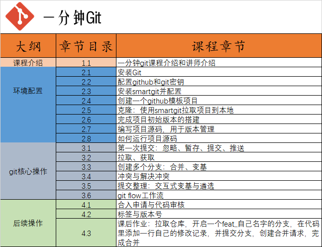

# 一分钟Git课程介绍

hello大家好，我是周旋，B站UP主【周旋机器视觉】。
个人主页：https://space.bilibili.com/387188622

UP机械转码，在制造业龙头大厂工作三年，目前在一家机器人独角兽公司做C++开发工程师。

一分钟Git课程是完全免费的，课程发布在B站，课程主页在我个人网站：https://www.roundvision.cc/git/gitoneminute/

课程面向所有Git使用的小白，学完你将能直接使用git完成自己项目的版本管理，甚至满足你在公司工作的99%的操作。

课程最大的亮点就是，不讲命令行。git的命令行只是一个工具，很多课程一上来就讲命令行，这是南辕北辙。真正要学的，是实操，是版本控制的思想。

一分钟Git课程将基于smartgit软件，为大家讲解仓库、拉取、推送、合并、变基、冲突解决、版本管理等核心思想，掌握了思想，你不论是用VSCode的git插件，还是使用专业的smartgit交互软件，还是用命令行，都不会有任何问题。

## 课程目录如下：

